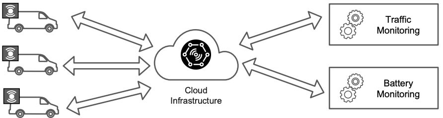
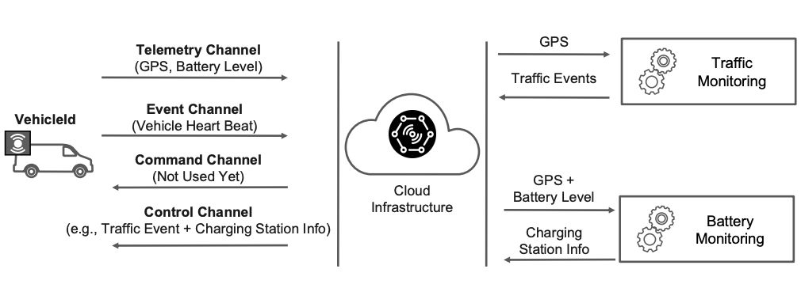
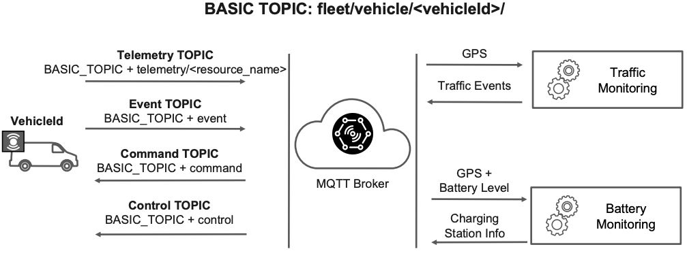
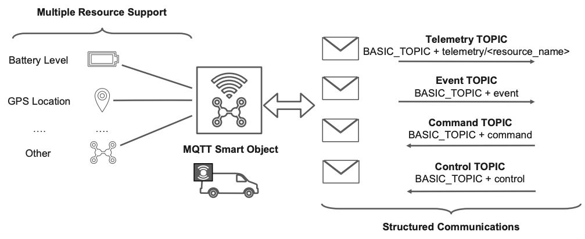

# MQTT Smart Object Design

## Use Case Presentation

The application use case focuses on real-time monitoring of electric vehicles within a company's fleet during working hours. Each vehicle is equipped with sensors to collect:

- **GPS Position**
- **Battery Level**

Two centralized applications process the real-time data to:

- Provide traffic information feedback if a vehicle is near a traffic jam.
- Analyze battery levels and suggest possible charging stations to the vehicle.

## Application Use Case - Fleet Monitoring



_Figure: System architecture showing vehicles publishing GPS and battery data to the MQTT broker, with consumer applications processing traffic and battery information._

## Data & Communications

  
_Figure: Data flow diagram illustrating the communication between vehicles, the MQTT broker, and consumer applications._

> ⚠️ **Note**: At this stage we are not considering security and authentication for involved vehicles

## MQTT Design Overview

  
_Figure: Overview of the MQTT design, showing the producer (vehicle emulator) publishing data to the MQTT broker, and consumer applications subscribing to relevant topics._

> ⚠️ **Note**: At this stage we are not considering security and authentication for involved vehicles

## Smart Object Modelling

  
_Figure: Smart object modelling diagram showing the structure of the vehicle smart object, including attributes for GPS position and battery level._

## Software Libraries

- **Python**: Used for both producer (vehicle emulator) and consumer applications.
- **paho-mqtt**: MQTT client library for Python.
- **gpxpy**: Library for parsing and generating GPX files, used to simulate vehicle GPS tracks.
- **Docker**: For running the MQTT broker (Eclipse Mosquitto).

---

## Setup Python Environment

1. Create a virtual environment:
   ```bash
   python3 -m venv .venv
   ```
2. Activate the virtual environment:
   - On Windows:
     ```bash
     .venv\Scripts\activate
     ```
   - On macOS/Linux:
     ```bash
     source .venv/bin/activate
     ```
3. Install the required packages using `pyproject.toml`:
   ```bash
   pip install .
   ```
   Alternatively, if you want to install the dependencies in editable mode (useful for development):
   ```bash
   pip install -e .
   ```

## MQTT Broker Configuration

- The MQTT broker is configured using the Eclipse Mosquitto Docker image. Check the configuration file [mosquitto.conf](/mqtt-broker/mosquitto/config/mosquitto.conf) for details.

### Running the MQTT Broker

1. Ensure Docker is installed and running on your machine.
2. Navigate to the `mqtt-broker` directory.
3. Run the following command to start the MQTT broker:
   ```bash
   docker-compose up -d
   ```
4. To see the logs, check the `mqtt-broker/mosquitto/log` directory. The logs will show the connection status of the clients and any messages published or received.
5. To stop the broker, run:
   ```bash
   docker-compose down
   ```

## Running the Application

1. Ensure the MQTT broker is running.
2. Open a terminal and navigate to the `process` directory.
3. Start the producer (vehicle emulator) application:

```bash
python vehicle_smart_object_process.py
```

4. Open another terminal and navigate to the `consumer` directory.
5. Start the consumer application:
   ```bash
   python traffic_smart_object_process.py
   ```
6. Open another terminal and navigate to the `consumer` directory.
7. Start the battery consumer application:
   ```bash
   python battery_smart_object_process.py
   ```
8. You can monitor the logs of the MQTT broker to see the messages being published and consumed.
9. To stop the applications, simply terminate the running processes in their respective terminals (e.g., using `Ctrl+C`).
